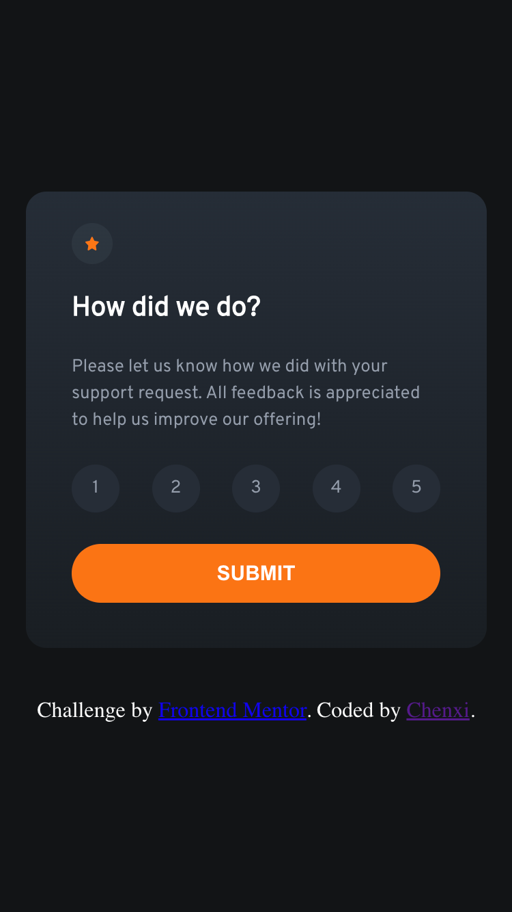

# Frontend Mentor - Interactive rating component solution

This is a solution to the [Interactive rating component challenge on Frontend Mentor](https://www.frontendmentor.io/challenges/interactive-rating-component-koxpeBUmI). Frontend Mentor challenges help you improve your coding skills by building realistic projects.

side note *  I only developed for 1440 x 800 and 375 x 667 screen sizes since that's the only sizes to develop for.

## Table of contents

- [Overview](#overview)
  - [The challenge](#the-challenge)
  - [Screenshot](#screenshot)
  - [Links](#links)
- [My process](#my-process)
  - [Built with](#built-with)
  - [What I learned](#what-i-learned)
  - [Continued development](#continued-development)
- [Author](#author)

**Note: Delete this note and update the table of contents based on what sections you keep.**

## Overview

### The challenge

Users should be able to:

- View the optimal layout for the app depending on their device's screen size
- See hover states for all interactive elements on the page
- Select and submit a number rating
- See the "Thank you" card state after submitting a rating

### Screenshot



Add a screenshot of your solution. The easiest way to do this is to use Firefox to view your project, right-click the page and select "Take a Screenshot". You can choose either a full-height screenshot or a cropped one based on how long the page is. If it's very long, it might be best to crop it.

Alternatively, you can use a tool like [FireShot](https://getfireshot.com/) to take the screenshot. FireShot has a free option, so you don't need to purchase it. 

Then crop/optimize/edit your image however you like, add it to your project, and update the file path in the image above.

**Note: Delete this note and the paragraphs above when you add your screenshot. If you prefer not to add a screenshot, feel free to remove this entire section.**

### Links

- Solution URL: (https://github.com/Chenxi96/InteractiveRatingComponent)
- Live Site URL: (https://jade-shortbread-232c94.netlify.app/)

## My process

### Built with

- Semantic HTML5 markup
- CSS custom properties
- Flexbox
- [React](https://reactjs.org/) - JS library
- SASS


### What I learned

I started on using the react library but instead of me using Create React App (CRA) I ended up using vite to start a react app. The reason why is because the amount of files the CRA has to make a react app is really big and it takes times to load, so I decided to use vite for the fast load up even though it won't matter with this application. With my recent knowledge about DOM tree traversing I was able to select a specific rating and store the number in a useState variable and after submitting show it on the thank you page.

see below:

```jsx
<div id='firstContainer' className='firstContainer'>
        {/*   Rating state start    */}
        <div id='starContainer' className='starContainer'>
          
        </div>
        <h1 id='title1'>How did we do?</h1>

        <p id='description' className='description'>
          Please let us know how we did with your support request. All feedback is appreciated 
          to help us improve our offering!
        </p>

        <ul id='ratingContainer' className='ratingContainer'>
          <li  onClick={selectOption}>1</li>
          <li  onClick={selectOption}>2</li>
          <li  onClick={selectOption}>3</li>
          <li  onClick={selectOption}>4</li>
          <li  onClick={selectOption}>5</li>
        </ul>

        <button id='button' type="button" onClick={afterSubmit}>SUBMIT</button>
        {/* Rating state end */}
      </div>
```
```scss
li {
  display: flex;
  justify-content: center;
  align-items: center;
  width: 50px;
  height: 50px;
  background-color: hsl(213, 19%, 18%);
  border-radius: 100%;
  cursor: pointer;
}

li:hover {
  background-color: hsl(25, 97%, 53%);
  color: hsl(0, 0%, 100%);
}


button {
  display: block;
  height: 13%;
  border-radius: 25px;
  font-size: 15px;
  border-style: none;
  background-color: hsl(25, 97%, 53%);
  color: hsl(0, 0%, 100%);
  font-weight: 700;
  cursor: pointer;
  margin-bottom: 10px;
}

button:hover {
  background-color: hsl(0, 0%, 100%);
  color: hsl(25, 97%, 53%);
}
```
```js
  const [rating, useRating] = useState('');

  function afterSubmit() {
    if(firstContainer.style.display === '') {
      firstContainer.style.display = 'none';
      secondContainer.style.display = 'flex';
    }
  }

  function selectOption(event) {
    useRating(event.target.innerText);
    ratingContainer.childNodes.forEach(node => {
      console.log(node.style.backgroundColor)
      if(node.style.backgroundColor === 'rgb(124, 135, 152)') {
        node.style.backgroundColor = 'hsl(213, 19%, 18%)';
        node.style.color = 'hsl(217, 12%, 63%)'
      }
    })
    event.target.style.backgroundColor = 'hsl(216, 12%, 54%)';
    event.target.style.color = 'hsl(0, 0%, 100%)';
  }
```

### Continued development

Would like to work with React some more and get comfortable with lifecycle and components.


## Author

- Website - [Chenxi](https://my-portfolio-vert-xi-14.vercel.app/)
- Frontend Mentor - [@Chenxi96](https://www.frontendmentor.io/profile/Chenxi96)
- Twitter - [@Chenxi_Lin_](https://www.twitter.com/Chenxi_Lin_)

